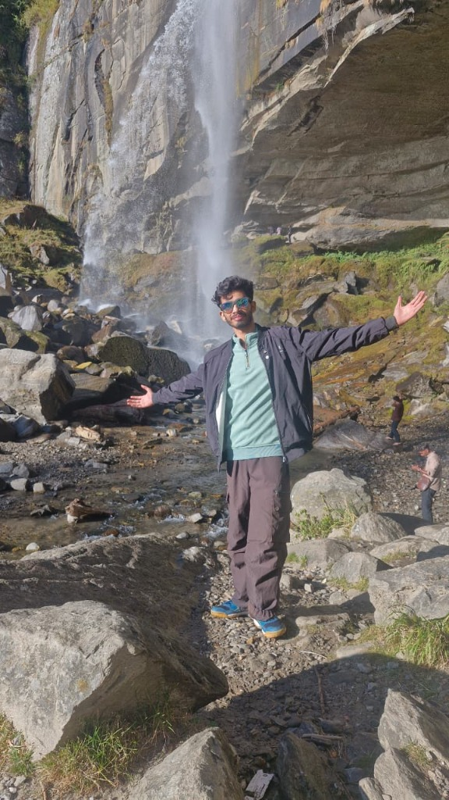

<p align="center">
  
</p>

<h1 align="center">Bipul Chamoli — Portfolio</h1>

<p align="center">
  <em>My personal portfolio showcasing my projects, skills, and journey as a Full Stack Developer.</em>
</p>

<p align="center">
  <a href="https://nextjs.org"></a>
  <a href="https://react.dev"></a>
  <a href="https://www.typescriptlang.org"></a>
  <a href="https://vercel.com"></a>
</p>

<p align="center">
  <a href="https://bipulchamoli.dev">🌐 Live Demo</a> •
  <a href="https://github.com/bipul724">GitHub</a> •
  <a href="https://leetcode.com/u/Bipul_Chamoli">LeetCode</a>
</p>

---

## 📸 Preview

> _Replace this with a screenshot of your deployed site:_

```

```

---

## 🧑‍💻 About

A clean, minimal, and responsive developer portfolio built with **Next.js 16** and **React 19**. It highlights my projects, technical skills, education, and achievements — designed to give recruiters and collaborators a quick snapshot of what I bring to the table.

---

## 🛠️ Built With

| Layer        | Technology                                                      |
| ------------ | --------------------------------------------------------------- |
| **Framework** | [Next.js 16](https://nextjs.org) (App Router)                  |
| **UI**        | [React 19](https://react.dev)                                  |
| **Language**  | [TypeScript 5.9](https://www.typescriptlang.org)               |
| **Styling**   | Hand-written CSS — global design tokens + CSS Modules; Geist, Geist Mono & Instrument Serif via `next/font` |
| **Linting**   | [ESLint](https://eslint.org) with `eslint-config-next`         |
| **Hosting**   | [Vercel](https://vercel.com)                                    |

---

## ✨ Features

- 🖥️ **Live case studies** — client work (Sage Kite, Home Square Studios) shown in browser frames with full-page screenshots that scroll through the real site on hover
- 🚀 **"From domain to deploy"** — a terminal-style deploy log showing the GoDaddy → DNS → Vercel pipeline
- 🧭 **Floating pill navbar** — tightens on scroll, highlights the active section, shows my local IST time, full-screen menu on mobile
- 🧱 **Bento "About" grid** — bio, what I'm doing now, live local time, LeetCode stats, certifications and toolbox
- 🗂️ **Experience timeline** — work and education; hovering one entry dims the rest
- ✨ **Details** — cursor spotlight, glowing card borders, tech-stack marquee, film grain, page rails, scroll reveals
- 📋 **Copy-to-clipboard email** with screen-reader announcement
- ♿ **Accessible & responsive** — semantic landmarks, skip link, focus styles, `prefers-reduced-motion` support, mobile → desktop layouts

All content lives in [`src/data/content.ts`](src/data/content.ts) — edit that file to update projects, experience or skills.

---

## 🚀 Getting Started

### Prerequisites

- [Node.js](https://nodejs.org) **v18+**
- [npm](https://www.npmjs.com) (ships with Node)

### Installation

```bash
# 1. Clone the repository
git clone https://github.com/bipul724/portfolio.git

# 2. Navigate into the project
cd portfolio

# 3. Install dependencies
npm install

# 4. Start the dev server
npm run dev
```

Open [http://localhost:3000](http://localhost:3000) in your browser — you're all set 🎉

---

## 📁 Folder Structure

```
portfolio/
├── public/
│   └── bipul.jpg                # Profile photo
├── src/
│   ├── app/
│   │   ├── globals.css          # Design tokens, base styles & shared primitives
│   │   ├── icon.svg             # Favicon
│   │   ├── layout.tsx           # Fonts, metadata, Navbar + Footer, backdrop layers
│   │   └── page.tsx             # Main page — composes all sections
│   ├── assets/work/             # Screenshots of live projects
│   ├── data/
│   │   └── content.ts           # ← All site content (projects, experience, skills…)
│   └── components/              # Each component has a matching .module.css
│       ├── Hero.tsx             # Headline, polaroid photo, "live in production" links
│       ├── Navbar.tsx           # Floating pill nav + mobile menu
│       ├── Marquee.tsx          # Scrolling tech-stack strip
│       ├── CaseStudy.tsx        # Client work: header, browser frame, details, deploy log
│       ├── BrowserFrame.tsx     # Browser chrome with hover-to-scroll screenshot
│       ├── ProjectCard.tsx      # Side-project card
│       ├── Timeline.tsx         # Experience & education
│       ├── About.tsx            # Bento grid
│       ├── Contact.tsx          # Call to action
│       ├── Footer.tsx           # Footer with oversized wordmark
│       └── …                    # Small helpers: Reveal, Spotlight, LocalTime, CopyEmail, Icons
├── next.config.mjs              # Next.js configuration
├── tsconfig.json                # TypeScript configuration
└── package.json                 # Dependencies & scripts
```

---

## 📜 Available Scripts

| Command         | Description                          |
| --------------- | ------------------------------------ |
| `npm run dev`   | Start development server             |
| `npm run build` | Create production build               |
| `npm run start` | Serve the production build            |
| `npm run lint`  | Run ESLint checks                     |

---

## 📬 Contact

**Bipul Chamoli**

- ✉️ Email: [bipulchamoli45@gmail.com](mailto:bipulchamoli45@gmail.com)
- 🐙 GitHub: [github.com/bipul724](https://github.com/bipul724)
- 💻 LeetCode: [leetcode.com/u/Bipul_Chamoli](https://leetcode.com/u/Bipul_Chamoli)
- 🔗 LinkedIn: [linkedin.com/in/your-profile](https://linkedin.com/in/your-profile) <!-- Update with your actual LinkedIn -->

---

<p align="center">
  Built with ☕ and <a href="https://nextjs.org">Next.js</a> — by Bipul Chamoli
</p>
